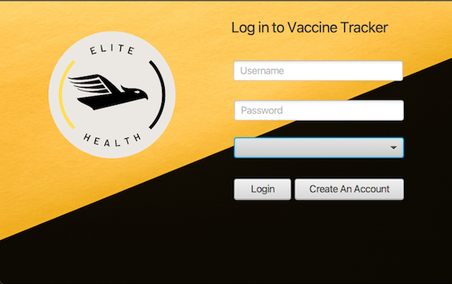
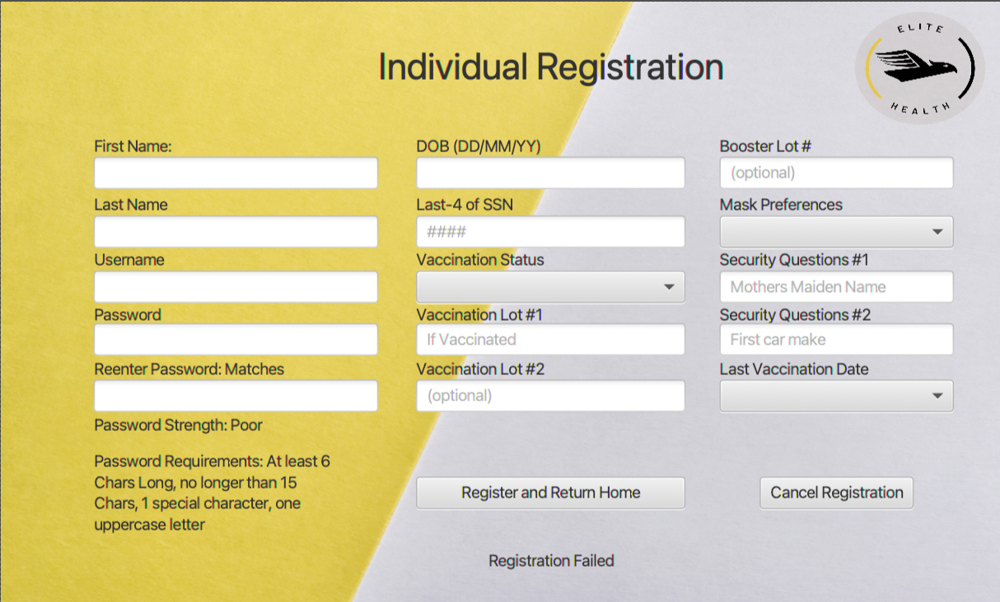
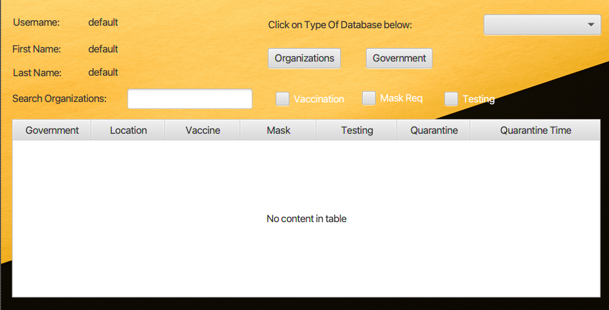

# **Vaccine Confirmation System**

## Overview

---

I spearheaded this project with two fellow students in creating this vaccine confirmation system during a Hackathon hosted by
the course Software Design. The main objective of this project was to develop a system that allowed users to create events and have others see if
they could go to these events based on their vaccination status. The project is a `JavaFx` application based in `Java`. The decision 
to use JavaFX was based on the simplicity of design in scene builder to finish the product quickly and efficiently in the 48 hours 
allocated in the Hackathon. Lastly, `MYSQL` was used for the database for its scalability, flexibility, and management ease.

## How it Works

---

There are three different kinds of users you can create

1) The individual - this user can declare their vaccination status and have it approved by the admins, as well as search the database for events they can attend with their status
2) Government - this user can dictate the required mandates for their province
3) Organization - this user can dictate the required mandates for their events and/or stores

When you start the app, you get the login page allowing account creation.

You can create any account except the admin, which is controlled separately by the coding team (us). This will then bring you to the registration page.

After creating an account, you can then manage your account and look at the companies in the database and their mandates.

## Credits

---

This project was only possible due to the contributions of my fellow groupmates:

- Adnane Ezhouri - Helped with the backend of the project focusing on the database and security
- Rida Errachidi - Process of switching between application screens
- Myself - Full-stack for the project

## License

---

MIT License

Copyright (c) 2022 Ben DeSollar

Permission is hereby granted, free of charge, to any person obtaining a copy
of this Software and associated documentation files (the "Software"), to deal
in the Software without restriction, including without limitation the rights
to use, copy, modify, merge, publish, distribute, sublicense, and/or sell
copies of the Software, and to permit persons to whom the Software is
furnished to do so, subject to the following conditions:

The above copyright notice and this permission notice shall be included in all
copies or substantial portions of the Software.

THE SOFTWARE IS PROVIDED "AS IS", WITHOUT WARRANTY OF ANY KIND, EXPRESS OR
IMPLIED, INCLUDING BUT NOT LIMITED TO THE WARRANTIES OF MERCHANTABILITY,
FITNESS FOR A PARTICULAR PURPOSE AND NON-INFRINGEMENT. IN NO EVENT SHALL THE
AUTHORS OR COPYRIGHT HOLDERS BE LIABLE FOR ANY CLAIM, DAMAGES OR OTHER
LIABILITY, WHETHER IN AN ACTION OF CONTRACT, TORT OR OTHERWISE, ARISING FROM,
OUT OF OR IN CONNECTION WITH THE SOFTWARE OR THE USE OR OTHER DEALINGS IN THE
SOFTWARE.

